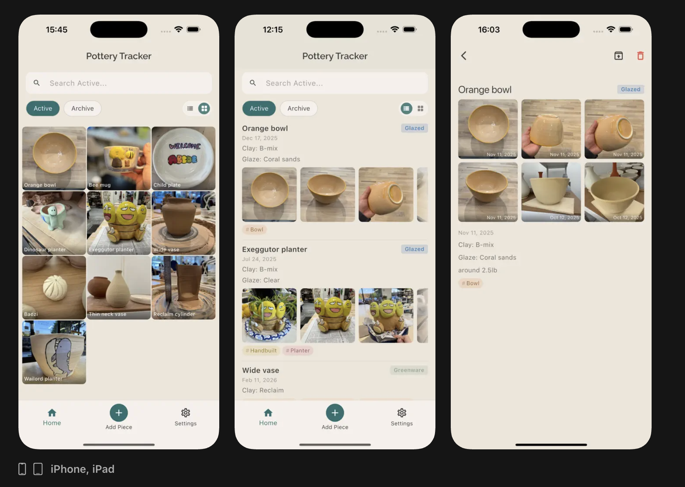

# Potter Journal

A photo-first pottery tracking app for iOS, built with Flutter and Firebase.

## Features

- Photo gallery for every piece
- Toggle between list or album view
- Track each stage: greenware, bisqued, glazed
- Log your clays and glazes
- Organize with custom tags
- Search and filter your entire collection
- Cloud sync to backup all your pieces

## How it's built

Flutter app with Riverpod for state management and Drift (SQLite) for local storage. Works fully offline. Search queries across all fields so you can find pieces by whatever you remember. Users can sign in with Google or Apple to sync their data to Firebase, so their work is preserved even if they lose or break their device. Photos are compressed before upload to keep cloud usage low.

Available on the [App Store](https://apps.apple.com/us/app/potter-journal/id6759199150).
